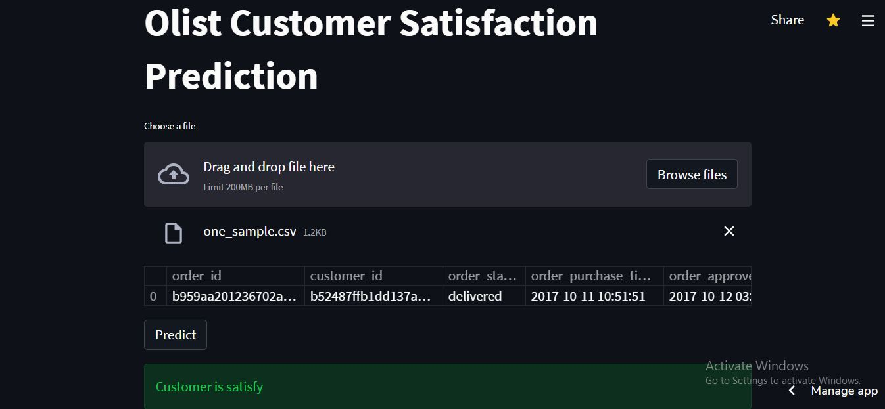

# Olist-Customer-Satisfaction-Prediction

Summary : Predicting customer satisfaction base on order, delivery and other data.

Olist is an Small and Midsize Business (SMB) commerce enabler ecosystem that specializes in the fields of logistics and capital. Commerce has changed and platforms like shopify, amazon, meli, alibaba and their peers are more and more relevant to our economy throughout the globe. This movement triggered a new generation of enablers to support small businesses navigate in suchrich and fragmented ecosystem. Olist is leading the way as the #1 commerce enabler for SMBs in Brazil, now expanding globally.

# [Deploy](https://share.streamlit.io/rushidarge/olist-customer-satisfaction-prediction/main/app.py)

